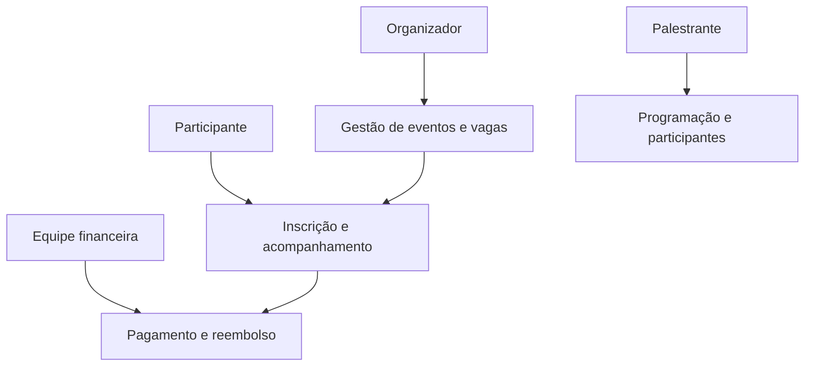

# Casos de uso

## Visão de atores e objetivos

## UC-01 — Criar e publicar evento

| Campo | Especificação |
|---|---|
| Ator principal | Organizador |
| Objetivo | Disponibilizar um evento com atividades, horários, capacidades e políticas. |
| Pré-condições | Organizador autenticado e autorizado. |
| Fluxo principal | 1. Criar evento. 2. Informar dados gerais. 3. Cadastrar atividades, horários, responsáveis e capacidade. 4. Configurar gratuidade/pagamento e políticas aplicáveis. 5. Revisar pendências. 6. Publicar. |
| Alternativas | Salvar como rascunho; corrigir conflito de programação; impedir publicação se faltar informação obrigatória. |
| Pós-condição | Evento publicado aparece no catálogo. |
| Pendências | Campos obrigatórios; alteração após inscrições; aprovação interna; granularidade das políticas. |

## UC-02 — Solicitar inscrição

| Campo | Especificação |
|---|---|
| Ator principal | Participante |
| Objetivo | Inscrever-se em evento e atividades selecionadas. |
| Pré-condições | Evento publicado e período de inscrição aberto. |
| Fluxo principal | 1. Consultar evento. 2. Selecionar atividades. 3. Sistema verifica identidade, capacidade, duplicidade e conflito. 4. Participante confirma dados e políticas. 5. Se gratuito e houver vaga, confirmar inscrição. 6. Se pago, encaminhar ao fluxo de pagamento. 7. Exibir e disponibilizar comprovante com a situação correta. |
| Alternativas | Atividade lotada oferece lista de espera; conflito é tratado conforme política; pagamento fica pendente; inscrição duplicada é tratada conforme decisão aprovada. |
| Pós-condição | Inscrição confirmada, pendente ou entrada em espera registrada. |
| Pendências | Reserva da vaga; política de conflito; autenticação; dados obrigatórios. |

## UC-03 — Confirmar pagamento

| Campo | Especificação |
|---|---|
| Atores | Equipe financeira; serviço de pagamento candidato |
| Objetivo | Registrar pagamento válido e liberar inscrição condicionada. |
| Pré-condições | Solicitação de inscrição paga existente. |
| Fluxo principal | 1. Receber ou localizar transação. 2. Validar referência, valor e situação. 3. Registrar confirmação. 4. Verificar disponibilidade/reserva. 5. Confirmar inscrição. 6. Notificar participante. |
| Alternativas | Pagamento recusado; valor divergente; confirmação após expiração; estorno; revisão manual. |
| Pós-condição | Pagamento e inscrição mantêm estados coerentes e auditáveis. |
| Pendências | Provedor, conciliação, expiração e tratamento da confirmação tardia. |

## UC-04 — Cancelar inscrição e tratar reembolso

| Campo | Especificação |
|---|---|
| Atores | Participante; equipe financeira; organizador em exceções |
| Objetivo | Encerrar uma inscrição conforme a política e, quando cabível, devolver valores. |
| Pré-condições | Inscrição existente e ator autorizado. |
| Fluxo principal | 1. Participante solicita cancelamento. 2. Sistema consulta política e prazo. 3. Exibe consequências e eventual reembolso. 4. Participante confirma. 5. Sistema cancela inscrição. 6. Libera vaga. 7. Inicia reembolso quando devido. 8. Avalia promoção da lista de espera. 9. Notifica resultado. |
| Alternativas | Cancelamento não permitido; análise manual; reembolso parcial; falha no reembolso. |
| Pendências | Prazos, percentuais, motivos e autoridade para exceções. |

## UC-05 — Administrar lista de espera

| Campo | Especificação |
|---|---|
| Atores | Participante; organizador |
| Objetivo | Ocupar vagas liberadas sem ultrapassar a capacidade. |
| Pré-condições | Atividade lotada e lista de espera habilitada. |
| Fluxo candidato | 1. Registrar entrada e posição. 2. Uma vaga é liberada. 3. Selecionar próximo elegível. 4. Oferecer vaga. 5. Aguardar aceite e, se necessário, pagamento. 6. Confirmar inscrição ou expirar oferta. 7. Prosseguir para o próximo. |
| Alternativas | Participante recusa; prazo expira; conflito surge; lista é encerrada. |
| Pendências | Ordem, automatização, prazo, número de ofertas simultâneas e pagamento. |

## UC-06 — Registrar presença e emitir certificado

| Campo | Especificação |
|---|---|
| Atores | Organizador; participante; palestrante somente se autorizado |
| Objetivo | Disponibilizar certificado válido a quem cumprir os critérios. |
| Pré-condições | Evento encerrado e inscrição elegível. |
| Fluxo candidato | 1. Registrar ou importar presença. 2. Encerrar apuração. 3. Sistema avalia critérios. 4. Gera certificado. 5. Participante consulta e baixa o documento. |
| Alternativas | Presença insuficiente; correção autorizada; certificado revogado e reemitido. |
| Pendências | Critério, método de presença, responsável, formato e validação do documento. |

## UC-07 — Consultar participantes da atividade

| Campo | Especificação |
|---|---|
| Ator principal | Palestrante |
| Objetivo | Consultar informações necessárias sobre inscritos em atividade própria. |
| Pré-condições | Palestrante autenticado e vinculado à atividade. |
| Fluxo principal | 1. Consultar agenda própria. 2. Selecionar atividade. 3. Sistema confirma vínculo. 4. Exibe lista com campos autorizados. |
| Alternativas | Atividade não vinculada; acesso fora do período; exportação não autorizada. |
| Pendências | Campos, exportação, período de acesso e registro de consulta. |
