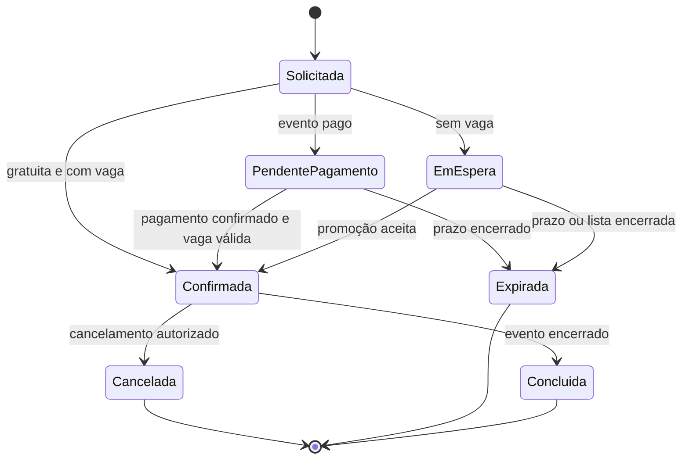
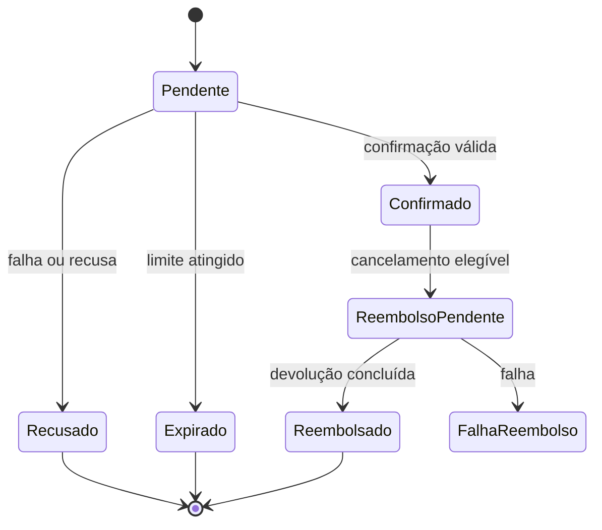
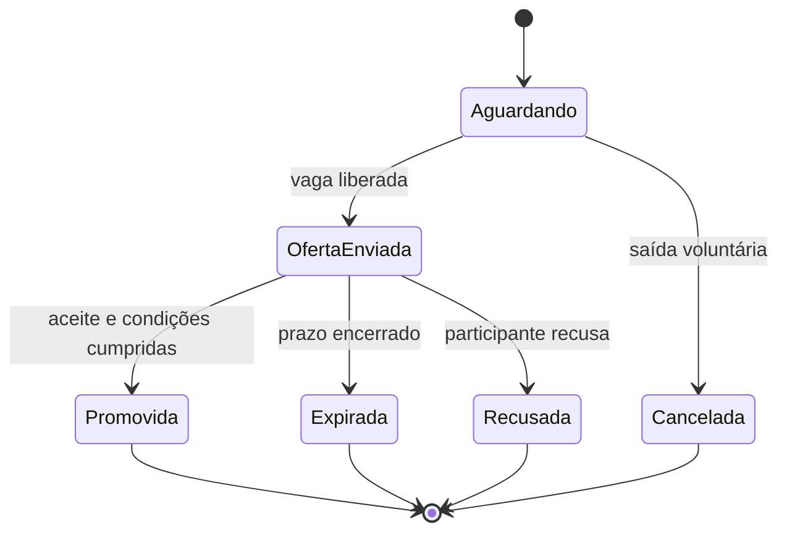
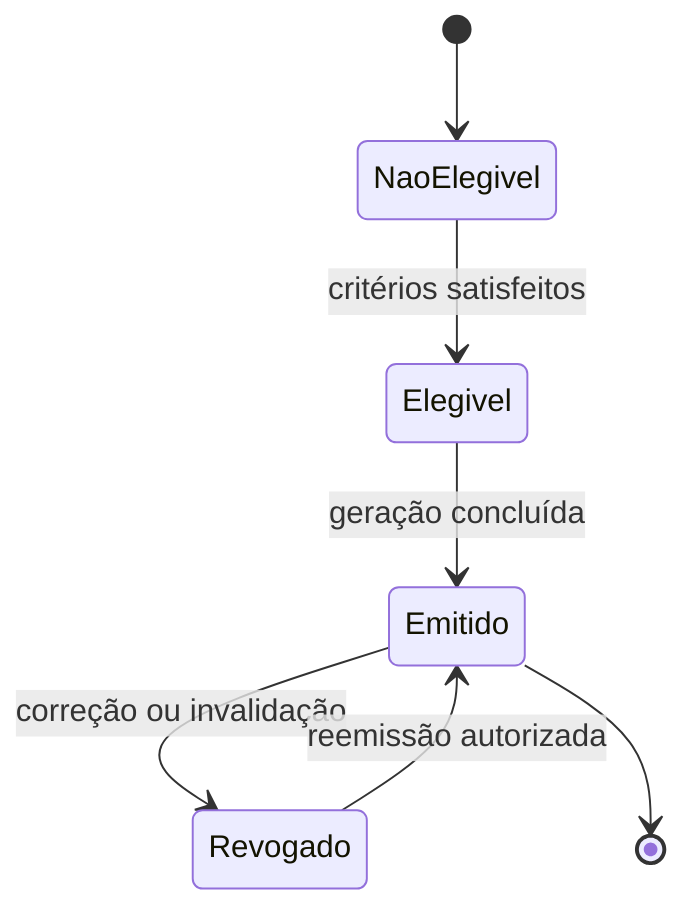

# Diagramas de estados

Os diagramas mostram ciclos de vida candidatos. Estados e transições marcados como dependentes de política devem ser validados antes da implementação.

## Inscrição

## Pagamento

## Entrada na lista de espera

## Certificado

## Transições que exigem decisão

| Transição | Decisão necessária |
|---|---|
| Pendente de pagamento → Confirmada | Se a vaga permanece reservada e como tratar confirmação tardia. |
| Solicitada → Em espera | Se a entrada é automática ou depende de aceite. |
| Oferta enviada → Promovida | Prazo, pagamento e tratamento de conflitos. |
| Confirmada → Cancelada | Prazo e autoridade para exceções. |
| Confirmado → Reembolso pendente | Elegibilidade e cálculo do valor. |
| Não elegível → Elegível | Presença mínima e demais critérios de certificação. |
