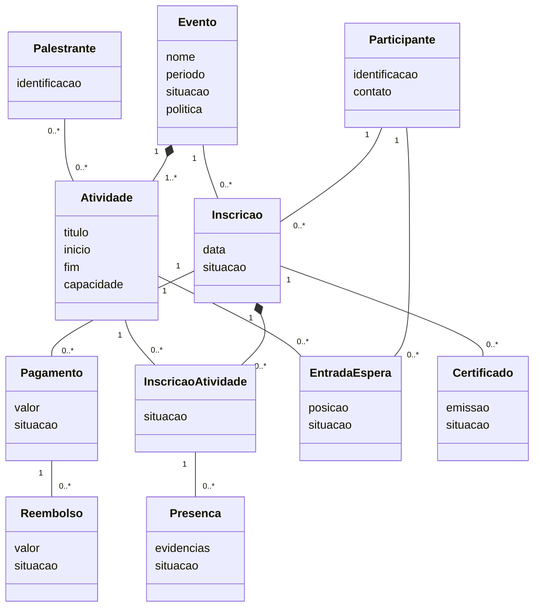

# Modelo conceitual de domínio

O modelo apresenta conceitos do negócio e seus relacionamentos. Ele **não** define tabelas, chaves físicas nem tecnologia de persistência.

## Responsabilidades conceituais

| Conceito | Responsabilidade |
|---|---|
| Evento | Agregar informações gerais, período e políticas da realização. |
| Atividade | Representar item da programação com horário, capacidade e palestrantes. |
| Inscrição | Representar o vínculo do participante com o evento e seu estado global. |
| InscriçãoAtividade | Representar seleção e situação do participante em cada atividade. |
| Pagamento | Registrar obrigação ou transação financeira associada à inscrição. |
| Reembolso | Registrar devolução vinculada a um pagamento. |
| EntradaEspera | Representar posição e evolução do participante na fila de uma atividade. |
| Presença | Manter evidência de participação para eventual certificação. |
| Certificado | Representar documento emitido, reemitido ou revogado. |

## Pontos de validação do modelo

- Confirmar se a inscrição é no evento, nas atividades ou em ambos.
- Confirmar se capacidade e política podem existir nos dois níveis.
- Definir se uma inscrição pode ter vários pagamentos ou apenas uma transação principal.
- Definir se presença é por atividade, por dia ou pelo evento inteiro.
- Definir se certificado é único por evento ou pode existir por atividade.
- Definir se lista de espera pertence somente à atividade ou também ao evento.
