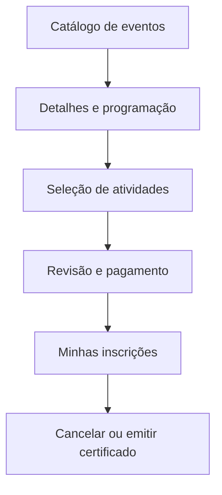

# Protótipos de baixa fidelidade

Os protótipos abaixo validam hierarquia de informação, permissões e fluxo. Não representam identidade visual final.

## Navegação principal

## P-01 — Catálogo de eventos

| Região | Conteúdo esperado |
|---|---|
| Cabeçalho | Marca Eventus, busca, acesso e “Minhas inscrições” |
| Filtros | Data, tipo, gratuito/pago e disponibilidade |
| Lista | Nome, data, local/modalidade, situação das vagas e ação “Ver detalhes” |
| Estados | Carregando, sem resultados, erro recuperável e eventos encerrados claramente diferenciados |

**Valida:** RF-01, RF-02, acessibilidade da busca e clareza da disponibilidade.

## P-02 — Detalhes e programação

| Região | Conteúdo esperado |
|---|---|
| Resumo | Nome, descrição, período, local/modalidade e gratuidade/valor |
| Políticas | Cancelamento, reembolso, certificação e uso de dados em linguagem clara |
| Programação | Atividade, horário, palestrante, vagas e seleção |
| Conflitos | Mensagem contextual conforme política aprovada |
| Ação | “Continuar inscrição” ou “Entrar na lista de espera” |

**Valida:** RF-05 a RF-10 e DL-01 a DL-05.

## P-03 — Revisão, pagamento e comprovante

| Região | Conteúdo esperado |
|---|---|
| Revisão | Evento, atividades, horários, valores e dados do participante |
| Consentimentos | Aceite das políticas e informações de privacidade aplicáveis |
| Pagamento | Meio, situação e prazo da eventual reserva de vaga |
| Resultado | “Confirmada”, “pagamento pendente”, “em espera” ou “não concluída” sem ambiguidade |
| Comprovante | Identificador, data, itens selecionados e situação; opção de consultar posteriormente |

**Valida:** RF-12, RF-14 a RF-17 e DL-02/DL-07.

## P-04 — Minhas inscrições

| Região | Conteúdo esperado |
|---|---|
| Lista | Evento, atividades, situação, pagamento e posição/oferta de espera quando aplicável |
| Ações condicionais | Pagar, cancelar, aceitar vaga, consultar comprovante e emitir certificado |
| Explicação | Motivo de ação indisponível e prazo relevante |
| Histórico | Mudanças e notificações essenciais |

**Valida:** RF-11 a RF-13, RF-17, RF-23 e RF-24.

## P-05 — Painel do organizador

| Região | Conteúdo esperado |
|---|---|
| Indicadores | Inscritos confirmados, pendentes, em espera, cancelados e ocupação por atividade |
| Gestão | Criar/editar evento, programação, capacidade e políticas |
| Participantes | Filtrar por atividade e situação; executar ações autorizadas |
| Alertas | Capacidade próxima do limite, pagamentos pendentes, falhas de notificação e conflitos |
| Auditoria | Acesso ao histórico de alterações críticas |

**Valida:** RF-04, RF-05, RF-18, RF-19 e definição de “tempo real”.

## P-06 — Painel financeiro

| Região | Conteúdo esperado |
|---|---|
| Filtros | Evento, período, situação do pagamento e do reembolso |
| Transações | Referência, participante minimizado, valor, situação e data |
| Ações | Confirmar/revisar pagamento, iniciar/acompanhar reembolso e registrar justificativa |
| Conciliação | Divergências, confirmações tardias e falhas destacadas |

**Valida:** RF-15 a RF-17 e segregação de permissões.

## P-07 — Área do palestrante

| Região | Conteúdo esperado |
|---|---|
| Agenda | Somente atividades vinculadas, com horário e local/modalidade |
| Participantes | Apenas campos e ações aprovados para a finalidade |
| Restrições | Exportação e período de acesso conforme política |
| Privacidade | Aviso de finalidade e registro de consulta quando aplicável |

**Valida:** RF-20, RF-21 e DL-09.

## Perguntas para teste dos protótipos

1. O participante distingue inscrição solicitada, reservada, paga, confirmada e em espera?
2. A política de cancelamento e o possível reembolso são compreendidos antes da inscrição?
3. O organizador entende em qual nível configura capacidade e políticas?
4. Financeiro e organizador distinguem suas permissões?
5. O palestrante considera suficientes os campos autorizados sem receber dados excessivos?
6. Usuários de teclado e leitor de tela conseguem concluir os fluxos críticos?
